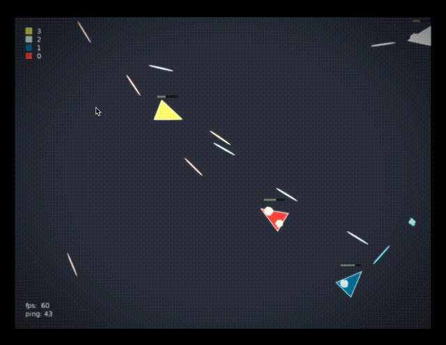

# Development PAUSED

**NOTE**: Development on this library has been paused, and efforts have shifted to a [new way of doing things](https://github.com/expo/share.lua). This was done after receiving some feedback from users using *sync.lua* about not being a fan of its OOP-y structure and of the lack of clarity in server vs. client code separation. The new library addresses these issues head-on. Stay posted!

# sync.lua

*sync.lua* aims to make Lua-based multiplayer games easier to write. You can write your game's code mostly as if you are writing a single-computer game and have automatic synchronization of your game state across multiple computers.

The library is meant to run in a [LÖVE](https://love2d.org/) context but could work anywhere [lua-enet](http://leafo.net/lua-enet/) and [LuaJIT's FFI library](http://luajit.org/ext_ffi.html) are available (both built-into LÖVE by default).

## Tutorials

Step by step guides that walk you through common *sync.lua* tasks.

- [Basic tutorial](./docs/tutorial_basic.md): This is probably what you want to read the first time you use *sync.lua*. Walks you through making a basic multiplayer game step-by-step from scratch. In the resulting game, each player that connects is given a single randomly-colored circle that they can move around on screen, and they can all see each others' circles.

## Examples

Working code for simple games that use *sync.lua*.

- [example_basic.lua](./example_basic.lua): The result of following the [basic tutorial](./docs/tutorial_basic.md).
- [example_triangle_warz.lua](./example_triangle_warz.lua): Each player is represented by a triangular ship that they can move around on screen and shoot at each other with. Demonstrates how you can keep track of multiple players, their scores, draw the user's player differently, keep track of entity-entity references (bullets need to keep track of their owners so they can increment the owner's score when they destroy a ship).
- [example_huge.lua](./example_huge.lua): The server simulates 20000 randomly positioned and sized rotating rectangles. Each client can walk around this simulation an just sees at most about 25 rectangles at a time. Demonstrates the `.isRelevant` feature. Sending updates about all 20000 rectangles would grind the game to a halt. Instead, for each client, the server only sends updates for the 25 rectangles each client can see. Uses the [shash](https://github.com/rxi/shash/blob/master/shash.lua) library to query rectangles in each client's field of view efficiently.

## Reference manual

The [reference manual](./docs/reference.md) (work in progress) contains detailed information about all of *sync.lua*'s features.
