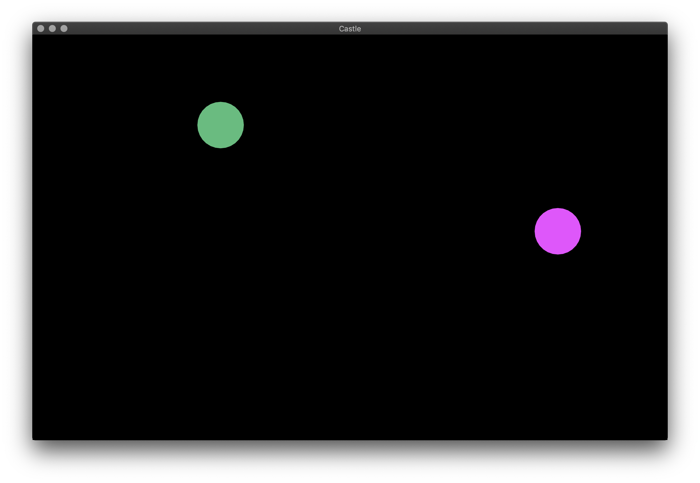
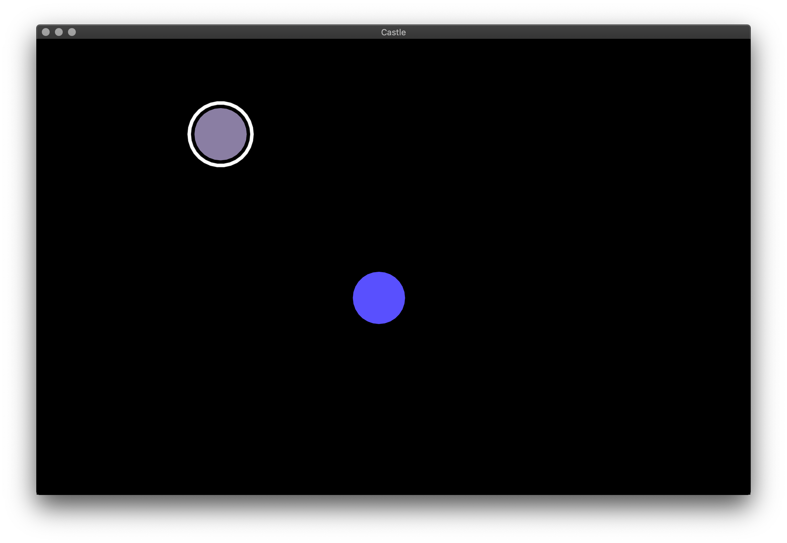

# Basic tutorial

In this tutorial we will build up to '[example_basic.lua](../example_basic.lua)'. In this example, each player that connects is given a single randomly-colored circle that they can move around on screen. You can see other players' circles too!

## Setup

In this tutorial we will be using the [LÖVE](https://love2d.org/) framework for drawing graphics and playing sounds. You could use 
LÖVE directly or you could use [Castle](https://www.playcastle.io/) (which the developer of sync.lua also works on) which gives you a viewer for LÖVE games posted on GitHub or available locally and also lets you load libraries directly from GitHub.

Start a new 'main.lua' file for your game.

If you're using plain LÖVE, download 'sync.lua' and 'bitser.lua' from the *sync.lua* repository and place them next to your source files. Then add `local sync = require 'sync'` in your 'main.lua' file to use *sync.lua*. Now load your 'main.lua' as you [normally would in LÖVE](https://love2d.org/wiki/Getting_Started).

If you're using Castle, you can just write `local sync = 'https://raw.githubusercontent.com/expo/sync.lua/master/sync.lua`. Then load 'main.lua' as you [normally would in Castle](https://medium.com/castle-archives/making-games-with-castle-e4d0e9e7a910).

We'll keep this `local sync = require ...` line at the top of the file.

To make sure things are working, add the following:

```lua
function love.draw()
    love.graphics.print('hello, world!', 20, 20)
end
```

Then reload the game. You should now see this (I'm using Castle--the title bar will be different for you in plain LÖVE):


Before we write more code, let's go over some background on how *sync.lua* splits work across multiple computers...

## Client / server system

In multiplayer games, multiple computers communicate over the internet or local networks to synchronize game state among themselves and give players the illusion that they are all playing in the same game world. *sync.lua* achieves this by designating one computer as the **server**, with all computers connecting to it called **clients**. The server runs the main instance of the game and sends updates to all clients to let them know what's happened in the game so far. Each client has a local *copy* of the game world that it updates according to these messages and displays to the user. This way all players see the same game world. Note that the clients don't talk to each other, they only talk to the server.

Clients also need a way to influence the game world so that players can actually make things happen in the game. In *sync.lua*, each client gets a **controller** object on which it can call methods--these methods are then triggered on the server and the server can make changes in the game world accordingly. In this sense, the controller objects are quite like physical game controllers in your hands (the clients) attached to a video game console (the server) that runs the actual game, hence the name.

Now let's write some code to actually create server and client instances of *sync.lua*...

## Creating server and client instances

Normally a game would list servers and let you connect to them or let you start your own server and invite a friend. For this basic example, let's just pick the computer we're coding on as the server for now, and also launch a client instance on the same computer. We'll make it so that the user can press '1' to launch a server, and '2' to connect as a client (again, in a real game you would make a nice menu screen). Put this before our existing `love.draw` code:

```lua
local server, client

function love.keypressed(key)
    if key == '1' then
        server = sync.newServer { address = '*:22122' }
    end
    if key == '2' then
        client = sync.newClient { address = '127.0.0.1:22122' }
    end
end
```

We're using `22122` as the port, and `'127.0.0.1'` basically means "local server", so that the client connects to the server running on the same computer.

We also need to call `:process()` on the client and server instances every frame. This makes them actually send and receive messages and update the game state accordingly. Add a `love.update` to do this (make sure to put it somewhere after the `local server, client` line):

```lua
function love.update(dt)
    if server then
        server:process()
    end
    if client then
        client:process()
    end
end
```

Now reload the game and press '1'. Oops! We get an error:

```
server needs `props.controllerTypeName`
```

This is because we need to specify a controller type to create for each client that joins the server. So let's do that...

## Adding a `Controller`

Before the `local server, client` line, add this:

```lua
local Controller = sync.registerType('Controller')
```

This registers a new type named `'Controller'` with *sync.lua*. You can use any system for defining types, such as [classic](https://github.com/rxi/classic) or [middleclass](https://github.com/kikito/middleclass), but the default *sync.lua* system works well for this example. *sync.lua* needs the notion of types so that it knows how to construct replica instances on clients and notify instances of events. This will make sense as we go on...

Let's update our `sync.newServer` call from before to use this controller type:

```lua
        server = sync.newServer { address = '*:22122', controllerTypeName = 'Controller' }
```

We could've named our controller type anything else, as long as we pass it to the above function this way.

Now reload the game. Press '1', then press '2'. There should be no errors. But the game doesn't show any feedback either. Let's fix that. Let's have our `Controller` `print` something when a client connects or disconnects:

```lua
function Controller:didSpawn()
    print('a client connected')
end

function Controller:willDespawn()
    print('a client disconnected')
end
```

The `server` spawns a `Controller` when a client connects and despawns it on disconnect.

Now if you reload and press '1' then '2' you should have the "a client connected" message be printed! You could launch a second instance of the game and just press '2' to connect to the first.

## (Optional) Connecting a different computer

If you have another computer, we could test that the server is accessible from it. Connect that computer to the same local area network (say by connecting to the same Wi-Fi router). [Get the local IP address](https://www.whatismybrowser.com/detect/what-is-my-local-ip-address) of your first computer, then update the `sync.newClient` line to use this IP address instead. For example, my local IP address is `'192.168.1.80'`, so I have this:

```lua
        client = sync.newClient { address = '192.168.1.80:22122' }
```

Now run your game on both computers (if using LÖVE you could copy the code, in Castle you could just serve the game on the first computer and use the local IP on the second). On the first computer, press '1' to start the server. Then on the second computer, press '2' to connect. On the first computer you should see the message "a client connected" be printed. If you quit the game on the second computer, you'll see the "a client disconnected" message be printed on the first after some time, because the server notices that the client has stopped responding.

Enough text output, let's show some graphics!

## Drawing some circles

We'll add a `Player` type that keeps track of its own position and color. Let's have it randomly assign both when it spawns:

```lua
local Player = sync.registerType('Player')

function Player:didSpawn()
    self.x, self.y = love.graphics.getWidth() * math.random(), love.graphics.getHeight() * math.random()
    self.r, self.g, self.b = 0.2 + 0.8 * math.random(), 0.2 + 0.8 * math.random(), 0.2 + 0.8 * math.random()
end
```

We're making the `r`, `g`, `b` values at least `0.2` so that the circles aren't too dark and we can tell them apart from the black background.

The `x`, `y`, `r`, `g`, `b` members are not special to *sync.lua*, we're just defining them in our `Player` type. The only *sync.lua*-defined names here are `sync.registerType` and `:didSpawn`.

Let's write a `draw` function for `Player` that actually draws it to the screen:

```lua
function Player:draw()
    love.graphics.push('all')
    love.graphics.setColor(self.r, self.g, self.b)
    love.graphics.ellipse('fill', self.x, self.y, 40, 40)
    love.graphics.pop()
end
```

This is regular LÖVE code. Let's replace `love.draw` to draw our `Player` instances on the client:

```lua
function love.draw()
    if client then
        for id, ent in pairs(client.all) do
            if ent.draw then
                ent:draw()
            end
        end
    end
end
```

`client.all` is a table of all entities replicated on the client, with unique id numbers as keys and the entity instances themselves as values (that's why we iterate with `for id, ent`). *sync.lua* has nothing to do with this `:draw` method or drawing logic, we're writing our own draw logic as we would in a regular LÖVE game. The only difference is that we need to look in `client` for the entities. An *entity* is just an instance of a type we registered with *sync.lua*.

Finally, let's make the `Controller` spawn a new `Player` instance on connecting and despawn it on disconnecting. Replace the code for `:didSpawn` and `:willDespawn` in `Controller`:

```lua
function Controller:didSpawn()
    self.player = self.__mgr:spawn('Player')
end

function Controller:willDespawn()
    self.__mgr:despawn(self.player)
    self.player = nil
end
```

`self.__mgr` is the "manager" for an entity, which can be used to spawn other entities or despawn entities (including an entity despawning itself).

It's important that we set `self.player` to `nil` after despawning it so that we don't sync a stale reference to the client. In general make sure to `nil`-out references to despawned entities. *sync.lua* will throw an error notifying you if it notices stale references when sync'ing.

Now re-run the game on the first computer and press '1' to launch the server, then '2' to connect as a client. You should see a circle! Re-run the second instance of the game (on either the same or a different computer) and press '2' and you'll see another circle pop up! You should see two circles on both instances, with the second one having popped up only when you connected from the second instance of the game. This will be the normal way to re-run the game from now on. At this point your game should look something like this (with your own random positions and random colors):



This was pretty fun so far, but now we're gonna get to the real fun bit: having players move things around! So onward...

## Moving the circles around

As we discussed before, controller entities provide the pathway for clients to influence the server's state. In fact, controllers are the only pathway--clients can't change the state of other entities on the server directly. This prevents confusion about which client is allowed to influence which entities.

Any method defined on a `Controller` can be called from the client. Let's add a method that lets clients cause the `Player` to start walking in some direction:

```lua
function Controller:setWalkState(up, down, left, right)
    self.player:setWalkState(up, down, left, right)
end
```

We'll pass `true` or `false` for each parameter depending on whether we want the `Player` to walk in that direction. Of course, we haven't defined this method on `Player` yet, so let's do that. We'll use `vx` and `vy` properties on `Player` to keep track of the velocity:

```lua
function Player:setWalkState(up, down, left, right)
    self.vx, self.vy = 0, 0
    if up then self.vy = self.vy - 40 end
    if down then self.vy = self.vy + 40 end
    if left then self.vx = self.vx - 40 end
    if right then self.vx = self.vx + 40 end
end
```

Let's initialize these values to `0` when the `Player` spawns. Add this to `Player:didSpawn`:

```lua
    self.vx, self.vy = 0, 0
```

We need to actually use these values to change `x` and `y` per-frame, so let's define an `:update` method that we'll call from `love.update`:

```lua
function Player:update(dt)
    self.x = self.x + self.vx * dt
    self.y = self.y + self.vy * dt
    self.__mgr:sync(self)
end
```

`self.__mgr:sync(<entity>)` marks `<entity>` as needing to be synchronized. Here we tell it to synchronize `self` since we updated `x` and `y` and we want to see the changes immediately on the client.

*sync.lua* needs to be explicitly told that entities need to be synchronized. This prevents needlessly sending data when nothing changed, and allows you to also decrease the frequency of syncs sent for some low-priority entities (eg. clouds moving around in the sky with no gameplay effect). 

Let's actually call this `:update` method on the server. In `love.update`, before the existing code calling `:process`, add:

```lua
    if server then
        for _, ent in pairs(server.all) do
            if ent.update then
                ent:update(dt)
            end
        end
    end
```

Again, just like for `:draw` before, this isn't special to *sync.lua*. We just added a regular `:update` method that we call ourselves, we could have named it differently too. *sync.lua* doesn't look at your own methods you add to types. This way you are free to perform updates, drawing, or other logic in any order you want specific to your game.

The last piece of the puzzle is actually calling the `:setWalkState` method of the controller on the client when keys are pressed  or released. Let's define a common `keyEvent` function and call it from both `love.keypressed` and `love.keyreleased`:

```lua
local function keyEvent(key)
    if client and client.controller then
        if key == 'up' or key == 'down' or key == 'left' or key == 'right' then
            client.controller:setWalkState(
                love.keyboard.isDown('up'),
                love.keyboard.isDown('down'),
                love.keyboard.isDown('left'),
                love.keyboard.isDown('right'))
        end
    end
end

function love.keypressed(key)
    -- ... keep existing code from `love.keypressed` here ...

    keyEvent(key)
end

function love.keyreleased(key)
    keyEvent(key)
end
```

This way we only call `:setWalkState` on key presses or key releases that should actually affect walking state. Controller method calls from clients need to go over the network, so make sure not to add needless calls (an example would be calling it every frame in this case, rather then only when the relevant keys are pressed or released). Here `client.controller` is a local proxy for the controller that forwards method calls to the server. If the client is still connecting or is disconnected, `client.controller` will be `nil`, so we check this before calling methods.

We've made quite some changes so you can check out the final state of the file at this stage [here](https://github.com/expo/sync.lua/blob/79ea997a7552bf66d68f47213430f29cc787a5df/example_basic.lua) if anything's unclear.

Now re-run the game (through the process described at the end of the last section) and you should be able to use the arrow keys move the circles around from each computer!

Each client only moves the circle that it owns. How does this happen? Each client gets a `Controller` spawned for it on connecting. So there are two `Controller`s. Due to our own code, each `Controller` spawns a `Player` and saves it as `self.player`, so there are two `Player`s too (hence we see two circles on screen). When you call `:setWalkState` from the client, it is *only* called on the `Controller` instance *for that client* on the server. This way the logic is properly routed to the correct `Player` instance.

You might be thinking, why do we have `Controller` at all, why not just have `Player` be the entity on which you can call methods on the server from the client? In a more involved game, it could be that the `Player` instance is destroyed due to some event (such as something exploding nearby). In some other games, there may not even be a clear `Player` instance too (consider multiplayer chess). Designating some type as always existing per client, independent of the lifetime of gameplay-related entities like `Player`, makes *sync.lua*'s own method routing logic simple and lets you define these game-specific cases in your `Controller`.

When you join the game, it's unclear which circle is owned by you until you hit the arrow keys and see what happens. Let's make the game highlight your circle so this is clear.

## Highlighting the users's own circle

First let's modify `Player:draw` to optionally draw a white outline around the circle:

```lua
function Player:draw(isOwn)
    love.graphics.push('all')
    love.graphics.setColor(self.r, self.g, self.b)
    love.graphics.ellipse('fill', self.x, self.y, 40, 40)
    if isOwn then
        love.graphics.setColor(1, 1, 1)
        love.graphics.setLineWidth(5)
        love.graphics.ellipse('line', self.x, self.y, 48, 48)
    end
    love.graphics.pop()
end
```

Now, in `love.draw` we should call this passing `true` if it's the user's own `Player`. In `love.draw`, we iterate through entities in `client.all`, which is a table containing the local replicas of the games entities. Since we set `self.player` in `Controller`, and `client.controller` refers to the local `Controller` replica for a client, `client.controller.player` will refer to the local `Player` replica for that client. *sync.lua* properly points entity cross-references to the correct local replicas when synchronizing. So we can change `love.draw` to the following:

```lua
function love.draw()
    if client then
        for _, ent in pairs(client.all) do
            if ent.__typeName == 'Player' then
                ent:draw(ent == client.controller.player)
            elseif ent.draw then
                ent:draw()
            end
        end
    end
end
```

*sync.lua* sets `.__typeName` for a type to be the name of that type. So the code just says, "if it's a `Player`, pass `isOwn` based on whether it's the client's `Controller`'s `Player`, else draw it normally." On re-running you should see that the user's own circle is highlighted:



In a more involved game you might want to set up the drawing transform to draw from the `Player`'s perspective, or specify an order of drawing entities, or some other custom logic. In any case, `client.controller` synchronizes the `Controller`'s members (just like for any other entity), which usually provides the pathway to player-specific data.

## Recap

That's it for this basic tutorial! To recap, here are the concepts we went over:

- **The client / server system**: With *sync.lua* you maintain the main game state on one computer called the **server** and send updates from it to many **clients**. The server's game state involves many *entities*. Each client maintains replicas of the entities on the server. All members of entities are synchronized to the client.
- **Controllers**: Each client has a controller entity representing it, whose lifetime matches the client's connection. Clients can remotely call methods on the server controller instance through the local replica at `client.controller`.
- **The `:didSpawn` event**: *sync.lua* calls `:didSpawn` on an entity when it is spawned.
- **`self.__mgr` and `:spawn` and `:despawn`**: Every entity has a `self.__mgr`, its *manager*, that lets you spawn new  entities or despawn existing ones.
- **The `:sync` call**: *sync.lua* needs you to explicitly call `self.__mgr:sync(<entity>)` specifying the entity to mark as needing synchronization.

All the other concepts used here--such drawing and updating--are from regular LÖVE game development. All *sync.lua* does is synchronize entity state and lifetimes among multiple computers, it isn't involved with updating, drawing, input or other game logic. This lets you implement those things in a way suited to your particular game.
